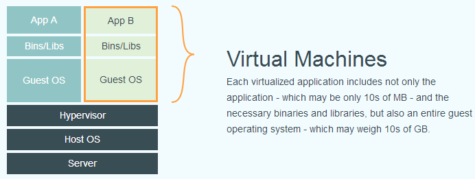

# What is docker ?

隨著硬體的發展，現今的電腦設備可以進行更高效的運算。然而，在這樣的背景下，大多數的app所需要的硬體運算需求並沒有如此大量的需求，而產生了「單機多工」的運作模式，加上app需要依賴作業系統環境而有了container的構想，並產出作業系統虛擬化的軟體，例如：Oracle VirtualBox、VMware的各種產品、Microsoft Hyper-V，和在Linux中被應用於伺服器的就是Linux Container \(Linux Container\)。

上圖所示。不論是上述何種產品，皆是透過硬體層的虛擬化技術達到在一台電腦中建立多個作業系統工作環境，而達到多工的目的。在如此的情況下一台電腦必須負荷機台本身作業系統、執行虛擬化的軟體和在軟體中執行的作業系統。以在Windows下透過VMware安裝Ubuntu為例，電腦必須負荷2套完整作業系統的維運和軟體運作的運算，需要使用相當多的運算資源。

## Reference

* \*\*\*\*[**Docker —— 從入門到實：什麼是Docker**](https://philipzheng.gitbooks.io/docker_practice/content/introduction/what.html)\*\*\*\*

